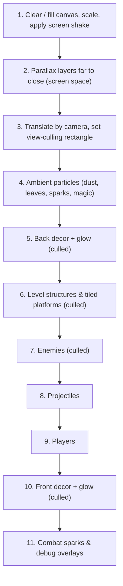

# PARALLAX_AND_RENDERING.md — Canvas 2D Pipeline & Parallax System

## 1. Visual Direction & Aesthetic Philosophy

*Vibrant Castle* follows the visual pillars in [`docs/tasks/VISION.md`](../tasks/VISION.md):

- **Aria of Sorrow style**: Gothic architecture, readable combat foregrounds, and distinct hero/enemy silhouettes across all three art tiers (`hi8bit`, `hi16bit`, `high`).
- **Autumn palette and mood**: Warm amber, rust, dark timber, and drifting leaves. Note: `aether_sanctuary` (and Aurelia's cyan identity) remain on the backlog for an autumn palette review ([`docs/tasks/VISION.md`](../tasks/VISION.md), Phase 8+ of [`docs/tasks/ROADMAP.md`](../tasks/ROADMAP.md)).

### Visual Invariants

- ✅ **Strong Silhouettes & Controlled Lighting**: Readable foreground entities separated from backdrops, with localized light-casting props (`DecorRenderer`).
- ❌ **Zero Allocations in `render()`**: All draw paths reuse preallocated scratch rectangles and vectors.

---

## 2. The Parallax Layer Hierarchy & Hybrid Registry

Every shipped location defines at least 5 standard background tiers (`far`, `mid_far`, `mid`, `mid_close`, `close`), and may include optional `boss_stage` (`scrollSpeedX: 0.44`) and `boss_world` (`scrollSpeedX: 0.24`, e.g. `eclipse_crown`) layers.

| Tier | Standard `scrollSpeedX` / `scrollSpeedY` | Alpha Contract | Visual Role |
| :--- | :--- | :--- | :--- |
| **`far`** | `0.04` / `0.02` | **100% Opaque (`opaque: true`)** | Horizon / skybox covering 100% of the viewport. |
| **`mid_far`** | `0.18` / `0.07` | True Transparency | Distant battlements and towers. |
| **`mid`** | `0.36` / `0.12` | True Transparency | Mid backdrop ramparts and arches. |
| **`mid_close`** | `0.56` / `0.18` | True Transparency | Near columns and framing stonework. |
| **`close`** | `0.78` / `0.24` | True Transparency | Foreground veil and silhouettes. |

### 2.1. Hybrid Parallax Layer Registry (`src/game/locations/parallaxLayerRegistry.ts`)

Location JSONs reference layers by key in `PARALLAX_LAYER_CATALOG`, organized into three namespaces:
- `world:<worldId>:far` — shared horizon backdrop per world.
- `shared:<tier>:<motif>` — reusable intermediate layers across stages.
- `boss:<scope>:<motif>` — dedicated spatial layers (`boss_stage`, `boss_world`).

`src/tests/arch/parallaxFiles.test.ts` guarantees every catalog entry and every location `layerKey`/`imageUrl` resolves to an existing file on disk. *(Note: the 3 newer worlds currently reference `.jpg` AI backdrops in `src/assets/images/` via the registry, whereas `.agents/rules/content_and_assets.md` targets PNG for standard textures).*

---

## 3. The `FAR` Layer Hard Invariant

1. **100% Viewport Coverage & Opacity**: The `far` layer must declare `"opaque": true` in location JSONs and cover the full viewport without transparent holes (`src/tests/arch/locationBlueprints.test.ts`).
2. **Non-`far` Layers**: Must never declare `opaque: true` and must use true alpha transparency.

---

## 4. Canvas 2D Rendering Pipeline & Compositing

```mermaid
graph TD
    Clear["1. Clear / fill canvas, scale, apply screen shake"]
    Parallax["2. Parallax layers far to close (screen space)"]
    Translate["3. Translate by camera, set view-culling rectangle"]
    Ambient["4. Ambient particles (dust, leaves, sparks, magic)"]
    BackDecor["5. Back decor + glow (culled)"]
    Structures["6. Level structures & tiled platforms (culled)"]
    Enemies["7. Enemies (culled)"]
    Projectiles["8. Projectiles"]
    Players["9. Players"]
    FrontDecor["10. Front decor + glow (culled)"]
    Sparks["11. Combat sparks & debug overlays"]

    Clear --> Parallax --> Translate --> Ambient --> BackDecor --> Structures --> Enemies --> Projectiles --> Players --> FrontDecor --> Sparks
```

### 4.1. Parallax Geometry & View Culling

- Source: `src/game/renderer/background/parallaxGeometry.ts`, `parallaxTiling.ts`, `src/game/renderer/parallax/parallaxImageRenderer.ts`.
- `MAX_LAYER_UPSCALE = 1.65` prevents soft over-stretching on tall boxes; `mirrorTile: true` flips alternating world tiles where edges are not seamless (`bun scripts/check-parallax-seams.ts`).
- `ViewCuller` (`src/game/renderer/viewCulling.ts`) expands the camera rectangle by `200 px` and skips out-of-view entities with zero per-frame allocations.

---

## 5. Atlas Quality Tiers & Sprite Anchoring

Source: `src/game/engine/atlas/`, `src/game/renderer/atlasSpriteRenderer.ts`, `src/game/engine/heroPixel/`.

### 5.1. Tiers (`low` = `hi8bit`, `mid` = `hi16bit`, `high` = `high`)

* **Fallback chain (`atlasVariantResolver.ts`)**: `low` → `low, mid, high`; `mid` → `mid, high, low`; `high` → `high, mid, low`; otherwise `proceduralFallback`.
* **Runtime SVG Rasterisation (`svgRaster.ts`)**: Enemy SVG sheets are rasterised once into an offscreen bitmap at integer scale (`≥ 192 px` cell width). **Backlog**: build-time baking of `hi16bit` SVGs into PNG atlases is tracked in [`VC-011`](../tasks/task-board.md#vc-011--hi16bit-build-step-svg-to-png-atlas).
* **Auto-discovery (`atlasFileDiscovery.ts`)**: Collects `src/assets/enemies/<id>/` and `src/assets/structures/<id>/` (`aether_gate`, `chrono_lever`, `grand_portcullis`, `hazard_thorns`).
* **Hero Pixel Tiers (`src/game/engine/heroPixel/`)**: `valen` and `aurelia` ship `<hero>_hi8bit.png`, `<hero>_hi16bit.png`, `<hero>_pixel_meta.json`, and painted `*_packed.png` sheets, maintaining consistent world height across tiers.

### 5.2. Current Asset Coverage

* **Enemies (`src/assets/enemies/`)**:
  * Both `hi8bit.svg` and `hi16bit.svg` exist for 11 enemies: `aether_archon`, `aether_sentinel`, `aether_wisp`, `chasm_crawler`, `chasm_gargoyle`, `chrono_hound`, `clockwork_automaton`, `court_sentinel`, `gear_mite`, `lantern_warden`, `thorn_creeper`.
  * `hi16bit.svg` only (missing `hi8bit.svg`): `bastion_sentinel_boss`, `shadow_knight`.
  * Painted PNGs: `clockwork_owl_gargoyle` (`*_packed_high.png` + `*_packed_meta.json`) and `training_dummy` (`*_high.png` + `*_meta.json`).
  * **Backlog**: Automated tier completeness reporting ([`VC-010`](../tasks/task-board.md#vc-010--three-tier-asset-policy-and-completeness-test)) and generating missing `hi8bit` placeholders ([`VC-012`](../tasks/task-board.md#vc-012--generate-missing-hi8bit-placeholders)); painted `high` enemy sheets are Phase 6+ backlog.

---

## 6. Platform Tilesets & Decor Props

* **Platform Tilesets (`src/game/engine/tiles/`, `StructureRenderer`)**: 8 shipped tilesets in `src/assets/tiles/` (`hi8bit` 16 px PNG, `hi16bit` 32 px PNG, `*_tiles_meta.json`). `buildTilePlan` caches a flat `Int32Array` draw plan per entity for allocation-free rendering. Enforced by `src/tests/arch/platformTilesets.test.ts`.
* **Decor Props (`src/game/engine/props/`, `DecorRenderer`)**: 12 shipped props in `src/assets/props/` (`hi8bit` drawn 2x, `hi16bit`, `*_prop_meta.json`) with simulation-tick deterministic animation and pre-rendered additive glow discs.
